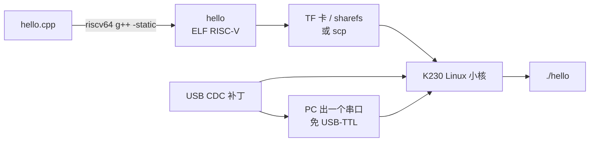

# k230-cpp-deploy

> **在 CanMV K230 / 庐山派（LCKFB）上跑原生 C++** —— 交叉编译、USB 免串口控制台、上板运行，一条龙。

[](LICENSE)
[](https://www.lckfb.com/)
[](#-快速开始5-分钟)
[](https://github.com/kendryte/k230_sdk)

**给不想被 MicroPython 卡住、想写 C++ 的人。**

官方例子几乎全是 CanMV（MicroPython）。你想跑 C++、调 KPU、榨干小核 Linux 性能，资料却散落在文档站各个角落。这个仓库把「编译 → 上板 → 拿到 shell → 跑起来」收成一条可复制的路径。

---

## 它解决什么

| 痛点 | 这里怎么干 |
|------|-----------|
| 工具链路径、`riscv64-unknown-linux-gnu-g++` 在哪 | `examples/hello/Makefile` 默认指向 SDK 内嵌工具链 |
| 只会 CanMV IDE，不会 Linux 小核 | 给出完整交叉编译 + 拷贝 + 执行流程 |
| 没有 USB 转串口模块，拿不到 shell | **USB CDC 控制台补丁**，插 USB 就出串口 |
| 官方 SDK 编译、镜像烧录步骤太长 | 按文档顺序抄作业即可 |
| 不知道静态/动态链接怎么选 | 示例默认 `-static`，拷过去就能跑 |

---

## 硬件与软件

- **板子**：CanMV K230 / 庐山派 LCKFB（本仓库按 `k230_canmv_lckfb_defconfig` 验证）
- **主机**：Windows + WSL2 Ubuntu 22.04（或原生 Ubuntu 20.04/22.04）
- **SDK**：[kendryte/k230_sdk](https://github.com/kendryte/k230_sdk)
- **工具链**：Xuantie-900-gcc-linux-5.10.4-glibc（SDK 自带）
- **可选**：Docker（编译 SDK 用官方镜像更省心）

---

## 快速开始（5 分钟）

假设你已经在 WSL 里有 `~/k230_sdk`，只想先把 C++ 跑通：

```bash
# 1. 拿到本仓库
git clone https://github.com/3025895987-hash/k230-cpp-deploy.git
cd k230-cpp-deploy

# 2. 交叉编译 hello
./scripts/build_hello.sh

# 3. 拷到板子（TF 卡应用分区 /sharefs，或 scp / U 盘）
cp examples/hello/hello /mnt/<你的TF卡应用分区>/

# 4. 上板执行（USB CDC 控制台或串口）
chmod +x /sharefs/hello
/sharefs/hello
```

预期输出：

```text
Hello from K230 C++!
```

---

## 整条路径（原理）



1. **交叉编译**：在 PC/WSL 用 RISC-V 工具链把 C++ 编成静态 ELF。  
2. **上板**：放进 TF 卡应用分区，或网络/串口拷贝。  
3. **控制台**：默认串口要 USB-TTL；打上 USB CDC 补丁后，**一根 USB 线既是供电也是 shell**。  
4. **运行**：登录后 `chmod +x` 再执行。

---

## 一、准备 K230 SDK

```bash
# WSL / Ubuntu
sudo apt update
sudo apt install -y git make wget curl ca-certificates docker.io
sudo service docker start

git clone https://github.com/kendryte/k230_sdk.git
cd k230_sdk
```

编译建议走官方 Docker 镜像，避免宿主机环境踩坑：

```bash
docker pull ghcr.io/kendryte/k230_sdk
```

板型配置用庐山派：

```bash
make CONF=k230_canmv_lckfb_defconfig
make
make build-image
```

> 完整编译过程较长（首次可能 1 小时以上）。中途 OpenSSL / 依赖报错时，先看官方 [K230 SDK 文档](https://www.kendryte.com/k230/en/main/01_software/board/K230_SDK_User_Manual.html)。

产物示例：

```text
output/k230_canmv_lckfb_defconfig/images/sysimage-sdcard.img
```

用 Rufus / balenaEtcher 写入 TF 卡（**会清空整张卡**，先备份）。

---

## 二、给固件加上 USB 串口（强烈推荐）

打完补丁后，PC 会多出一个串口设备，用 MobaXterm / PuTTY / `screen` 打开即可登录 Linux 小核（用户 `root`，密码为空）。

```bash
cd ~/k230_sdk

# 应用补丁（改 defconfig + 安装 S99usb-cdc）
git apply /path/to/k230-cpp-deploy/patches/0001-usb-cdc-acm-console.patch

# 把 init 脚本放进 usb_test 包
cp /path/to/k230-cpp-deploy/patches/S99usb-cdc \
   src/little/buildroot-ext/package/usb_test/src/S99usb-cdc

# 重编并出镜像
make CONF=k230_canmv_lckfb_defconfig
make build-image
```

补丁做了三件事：

1. 内核打开 `CONFIG_USB_CONFIGFS_ACM=y`
2. `usb_test.mk` 安装 `S99usb-cdc` 到 `/etc/init.d/`
3. `S99usb-cdc` 用 configfs 创建 ACM gadget，并起 `getty` 绑在 `/dev/ttyGS0`

细节见 [`patches/S99usb-cdc`](patches/S99usb-cdc)。

---

## 三、写你自己的 C++

最小工程就是 [`examples/hello`](examples/hello)：

```cpp
#include <iostream>

int main()
{
    std::cout << "Hello from K230 C++!" << std::endl;
    return 0;
}
```

编译：

```bash
# 方式 A：Makefile（自动找工具链）
cd examples/hello && make

# 方式 B：一键脚本
./scripts/build_hello.sh

# 方式 C：手写一行
~/k230_sdk/toolchain/Xuantie-900-gcc-linux-5.10.4-glibc-x86_64-V2.6.0/bin/riscv64-unknown-linux-gnu-g++ \
  hello.cpp -static -O2 -o hello
file hello   # 应看到 ELF 64-bit ... RISC-V
```

上板：

```bash
chmod +x /sharefs/hello
/sharefs/hello
```

---

## 常用命令速查

| 想干什么 | 命令 |
|---------|------|
| 看板子有没有你的程序 | `ls -lh /sharefs` |
| 跑起来 | `chmod +x ./hello && ./hello` |
| 动态链接版（更小） | 去掉 `-static`，注意板子上要有对应 `.so` |
| 重启 USB 控制台 | `/etc/init.d/S99usb-cdc restart` |
| 看 gadget 有没有起来 | `ls /sys/kernel/config/usb_gadget/k230-cdc` |
| 查看输出文件类型 | `file hello` |

---

## 目录说明

```text
k230-cpp-deploy/
├── README.md
├── examples/
│   └── hello/           # 最小 C++ 示例 + Makefile
├── patches/
│   ├── 0001-usb-cdc-acm-console.patch
│   └── S99usb-cdc       # USB 串口 init 脚本
├── scripts/
│   └── build_hello.sh   # 一键交叉编译
└── docs/
    └── FAQ.md
```

---

## FAQ

**Q: 必须用庐山派吗？**  
本仓库按 `k230_canmv_lckfb_defconfig` 验证。其他 K230 板型可换对应 `CONF=`，USB gadget 的 UDC 名字可能不同，需改 `S99usb-cdc` 里的 `UDC_NAME`。

**Q: 能不能在 CanMV MicroPython 里调 C++？**  
那是另一条路（原生模块 / 二进制）。本仓库面向 **K230 Linux 小核跑完整 C++ 程序**。

**Q: `-static` 好还是动态链接好？**  
演示和电赛现场建议 `-static`，不依赖板上库；量产可再优化体积。

**Q: 编译很慢 / OpenSSL 报错？**  
优先用官方 Docker 镜像；内存紧张时降低并行（`-j4` 甚至 `-j1`）。

**Q: 镜像文件能直接下载吗？**  
镜像体积约 512MB，不适合进 Git。请自行 `make build-image` 生成；需要分享时用网盘 / Release。

---

## 相关链接

- [K230 SDK 官方文档](https://www.kendryte.com/k230/en/main/01_software/board/K230_SDK_User_Manual.html)
- [K230 Linux 开发指南](https://www.kendryte.com/k230_linux/en/main/app_develop_guide/user_develop/debian_ubuntu.html)
- [kendryte/k230_sdk](https://github.com/kendryte/k230_sdk)
- [CanMV K230](https://www.kendryte.com/k230_canmv)

---

## Star

如果这个仓库帮你省了时间，点个 **Star** 让更多人看到。  
有板型适配、CMake 模板、摄像头/KPU 例子，欢迎 PR。

## License

[MIT](LICENSE)
